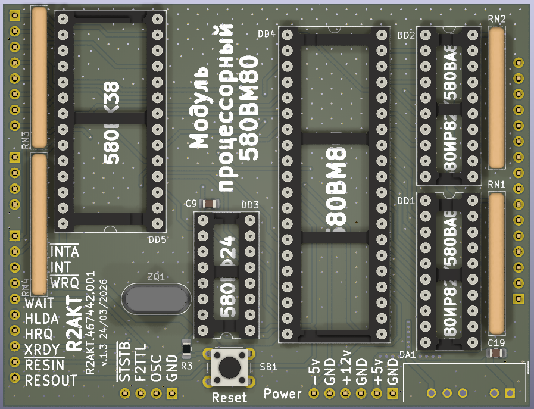

License addendum - https://github.com/R2AKT/CPU_8080/blob/main/Addendum.txt
# CPU_8080

580VM80a (8080a) CPU board.
For Mega-80 (Mega-580) DIY 8-bit micro-computer - https://github.com/R2AKT/Mega-80.

The board includes:
- processor = 580BM80a (8080a);
- clock generator = 580GF24 (8224); 
- data and control bus controller = 580BK28/38 (8228/8238);
- address bus buffer's = 2x580VA86 = (8286).

* There is a project option with the replacement of 580IR82/580V86 with 555AP6 (74LS245).

The board does not contain memory!

Status: tested in conjunction with an 8k linear memory module at a frequency of up to 3 MHz (quartz resonator 27 MHz).

Процессорная плата 580ВМ80а.

Плата содержит:
- процессор = 580ВМ80а;
- тактовый генератор = 580ГФ24;
- контроллер шины данных и управления = 580ВК28/38;
- буфер шины адреса = 2x580ВА86.

* Имеется вариант проекта с заменой 580ИР82/580ВА86 на 555АП6.

Плата не содержит память!

Статус: проверено совместно с модулем линейной памяти 8к на частоте до 3 МГц (кварцевый резонатор 27 МГц).
